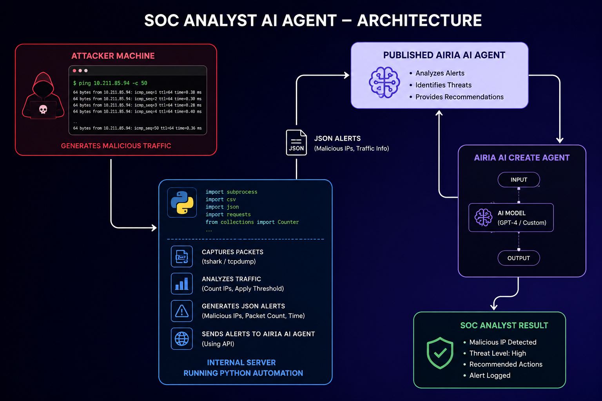
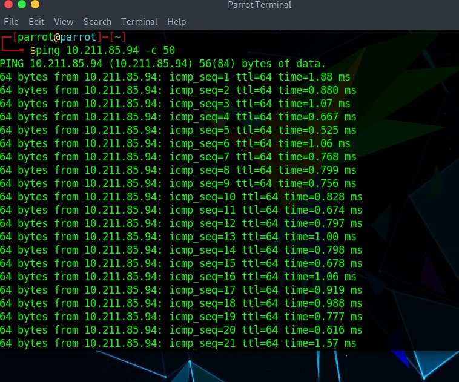
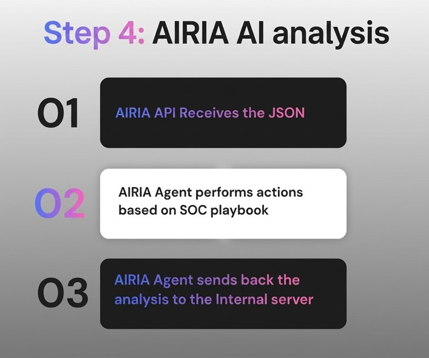
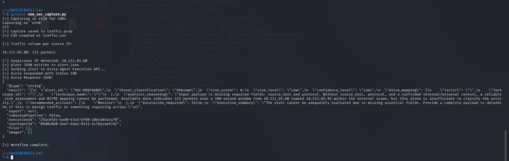

# SOC-Analyst-Ai-Agent
SOC Analyst AI Agent is an AI-powered cybersecurity solution designed to automate threat detection and analysis in a Security Operations Center (SOC) environment. The system captures network traffic, identifies suspicious activity based on predefined thresholds, generates JSON alerts, and sends them to an AI agent for automated analysis &amp; response.

SOC-Analyst-AI-Agent/
│
├── README.md
├── packet_capture.py
├── requirements.txt
│
├── screenshots/
│   ├── architecture.png
│   ├── attack_simulation.png
│   ├── ai_analysis.png
│   └── detection_result.png
│
├── samples/
│   ├── traffic.csv
│   └── alert.json
│
└── docs/
    └── project_report.pdf

    ## Architecture

## Attack Simulation

## AI Analysis

## Detection Result

# SOC Analyst AI Agent

cybersecurity
soc
soc-analyst
python
ai
threat-detection
network-security
incident-response
automation
